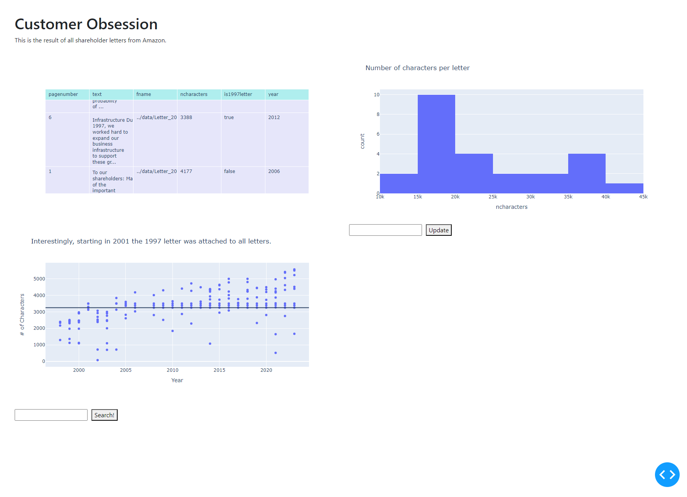

# Customer Obsession

This is a dashboard built with Dash that analyzes the last decade or so of shareholder letters from Amazon.

## This project consisted of a few main steps:

1. Download all the shareholder letters as pdfs (using `selenium`)
2. Pull the text out (using `pypdf`)
3. Analyze the text (using `nltk`)
4. Display the results (using `Dash`)

## Visual History:

- 10-10-2023:

    - 