# Customer Obsession

This is a dashboard built with Dash that analyzes shareholder letters from Amazon going back to 1998.

## This project consisted of a few main steps:

1. Download all the shareholder letters as pdfs (using `selenium`)
2. Extract the text out of the pdfs (using `pypdf`)
3. Analyze the text (using `nltk` and `wordninja`)
4. Display the results (using `Dash` and `Heroku`)

## Personal Goals

I had a few goals with this project:

1. Learn more about Dash
2. Learn more about sentiment analysis
3. Finish an end-to-end analytics project, starting from data collection (my selenium script) to a final deliverable (deployed dashboard)

And oh boy did I learn quite a bit:

- First and foremost, just the syntax and general workings of `Dash`, `plotly`, and `nltk`
- Identifiying "sentences" was harder than I anticipated, as I needed to take into accounts acronyms ("etc.")
- `pypdf` would sometimes combine words as each line broke, for example, if the pdf looked like this:
    ```
    a test sentence
    more words
    ```

- The text output would end up being: `a test sentencemore words`
    - I fixed this by using a package called [`wordninja`](https://github.com/keredson/wordninja) which will split the above into: `['a', 'test', 'sentence', 'more', 'words']`
- I built a lot of analysis on top of the lemmatized version of the text instead of the raw version, but I didn't quite crack how to map between the lemmatized -> raw text 
    - For example, if you search for a term on the search page, the concordance table on the bottom will show the _lemmatized_ version of the text instead of the raw version of the text. Definitely an area for improvement. 
- I really liked the development experience of `Dash`, the `@callback` decorator clicked with me and I feel way more confident building vizzes with `plotly` and adding interactivity with `Dash`.
- If you deploy an app to Heroku and mistakenly name your `Procfile` something like `ProcFile`, none of the dynos will get created in Heroku and the web service wont ever start. I needed to DELETE it, commit the deletion, deploy to Heroku, then re-add the Procfile (named correctly) and deploy.


## Random Notes

- My webscraping script isn't perfect, for some reason the css selector didn't download the 2007 letter so I just downloaded that one manually
- How you define "word" / "sentence" / "punctuation" can change the output your analysis dramatically

## Visual History:

- 10-28-2023:

    - 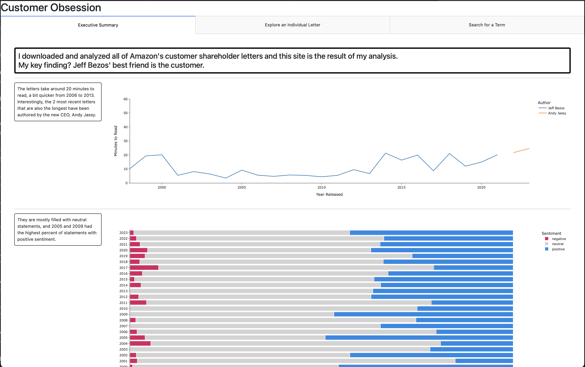
    - 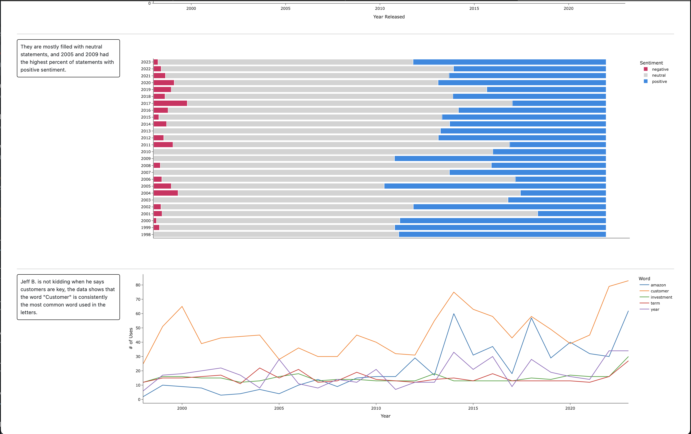
    - 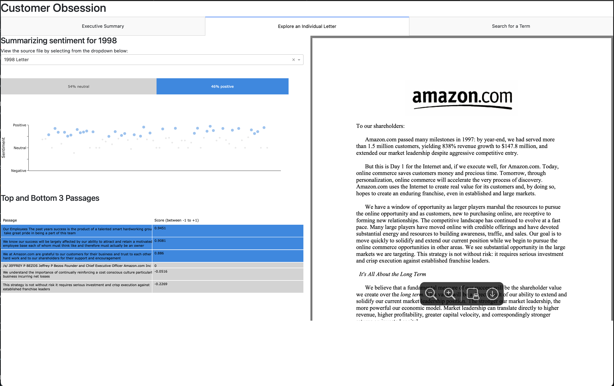
    - 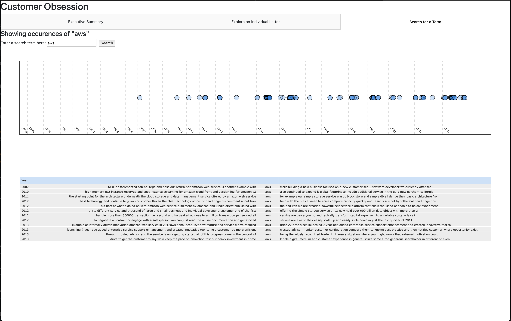

- 10-22-2023:

    - 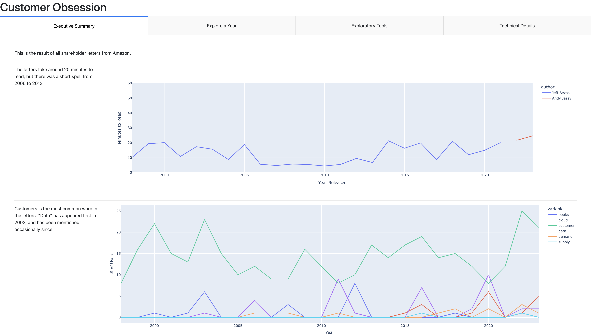
    - 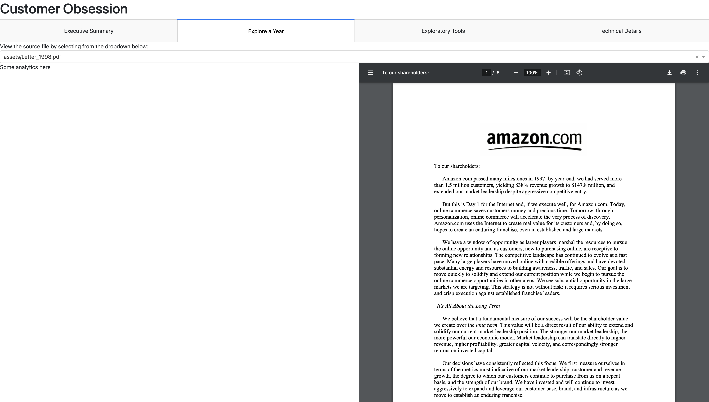
    - 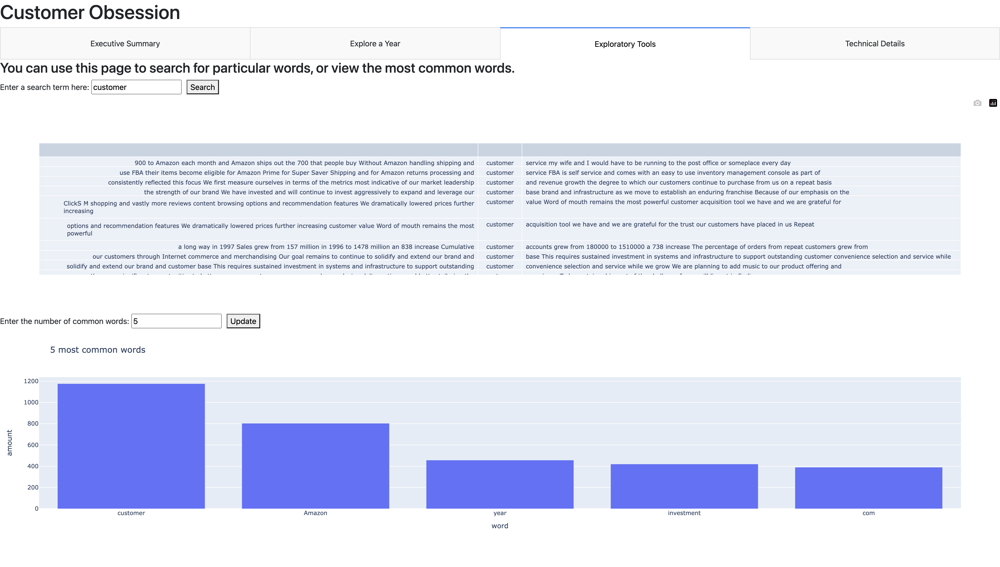
    - 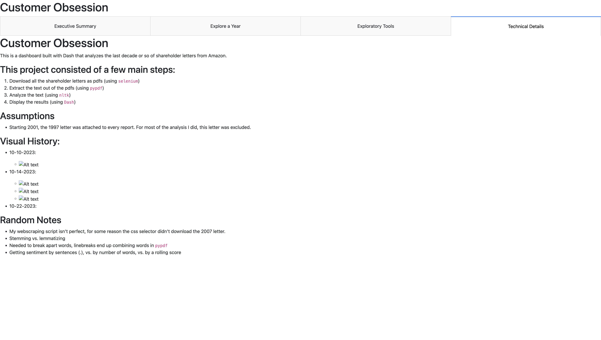

- 10-14-2023:

    - 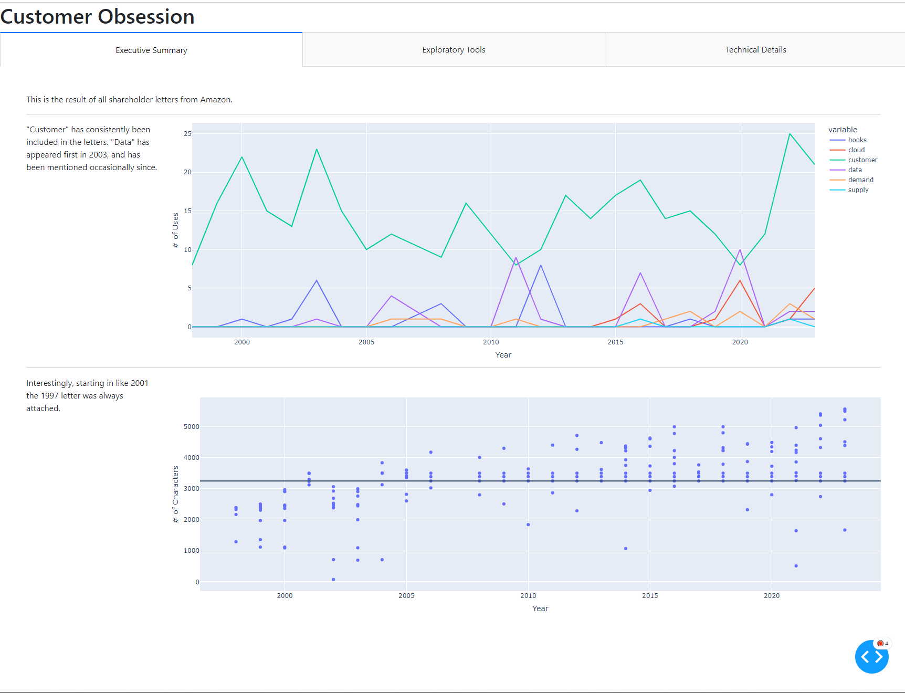
    - 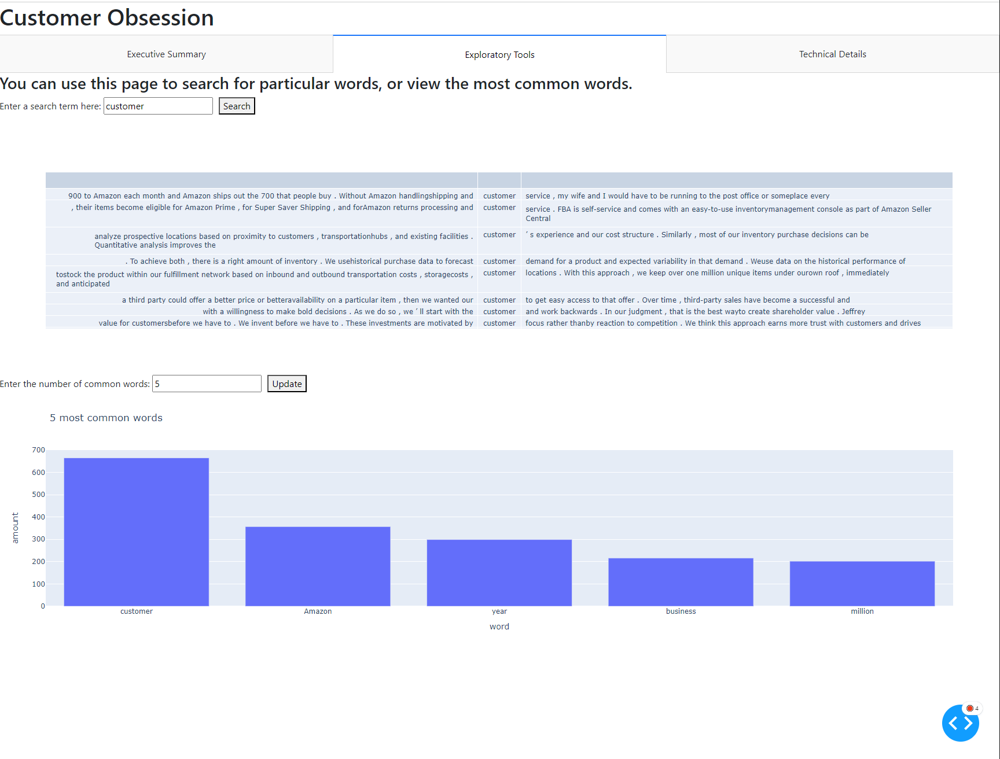
    - 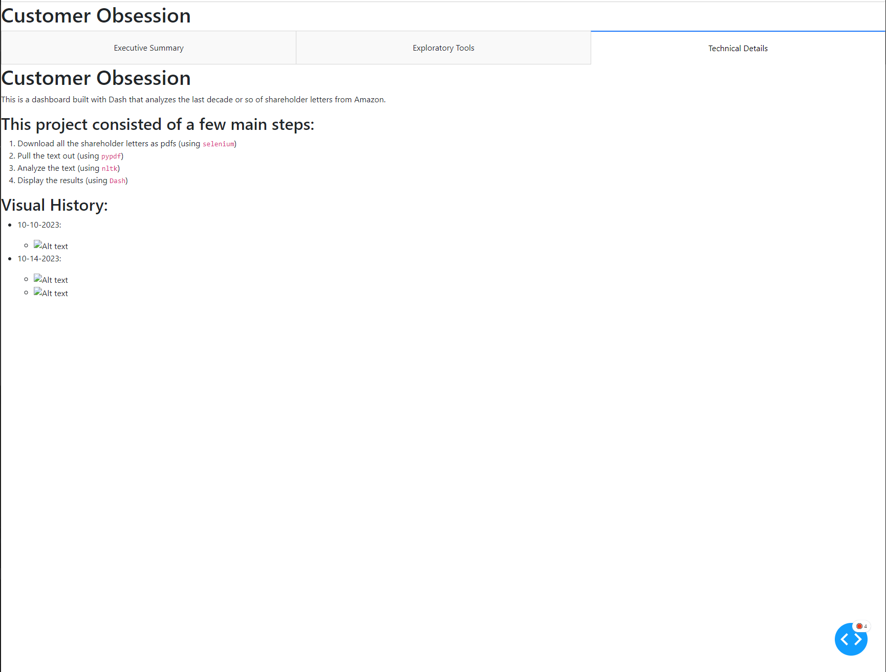

- 10-10-2023:

    - 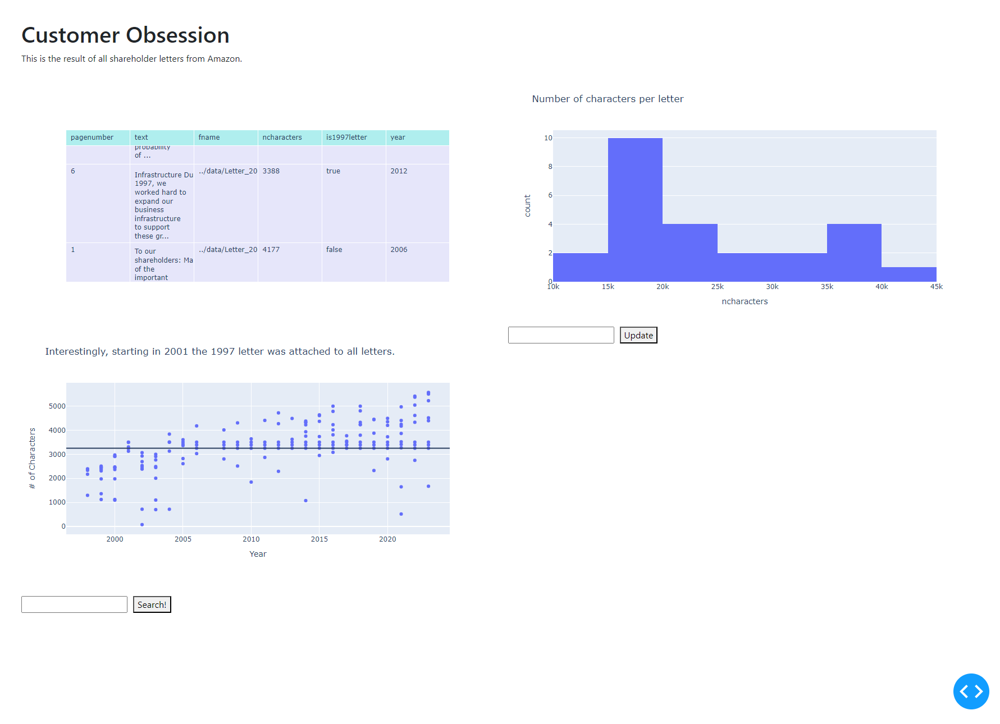
